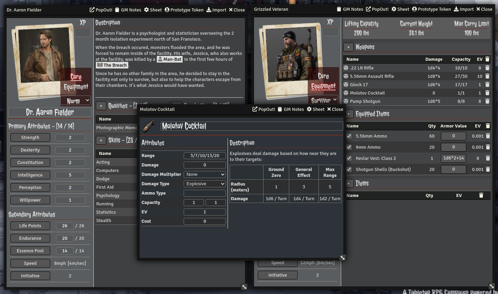
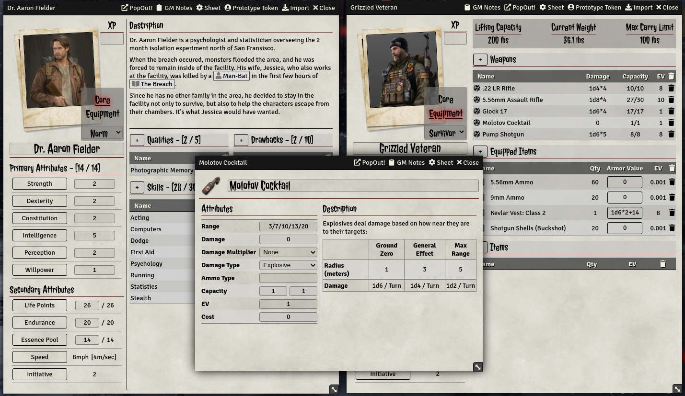

# AFMBE

After afmbe, a Foundry VTT v10 system made by DogBoneZone - This is for Foundry VTT v12

A fanmade FoundryVTT system to play All Flesh Must Be Eaten by Eden Studios. This system is unaffiliated with Eden Studios 
and uses no trademarked content or media from any of the games or rulebooks. The system merely provides a framework to play the game.
I highly encourage all users to buy or download a copy of the AFMBE Core Rulebook and many content additions. You can find some quick
links to purchase this content further below.

All rights for the game belong to Eden Studios and their affiliated partners. Eden Studios makes no represenation or warranty as to
the quality, viability, or suitability for purpose of this product.

You can purchase the rulebooks from their website https://www.edenstudios.net/ or from DrivethruRPG at
https://www.drivethrurpg.com/browse/pub/10/Eden-Studios/subcategory/57_60/All-Flesh-Must-Be-Eaten

<figure>
    
    <figcaption>Dark Mode (Default Setting)</figcaption>
</figure>

<figure>
    
    <figcaption>Light Mode (Enabled through System Settings)</figcaption>
</figure>
